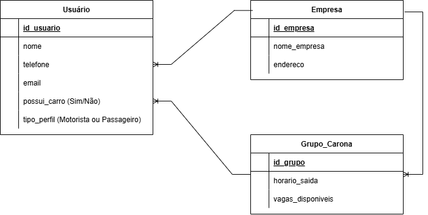
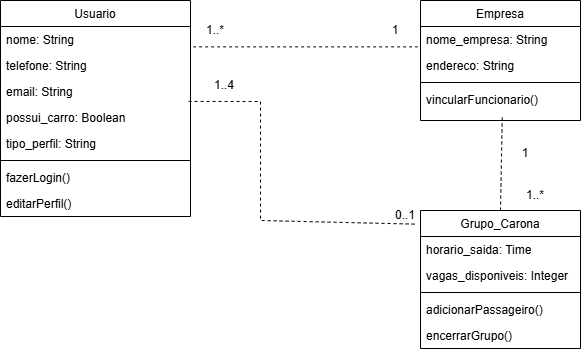
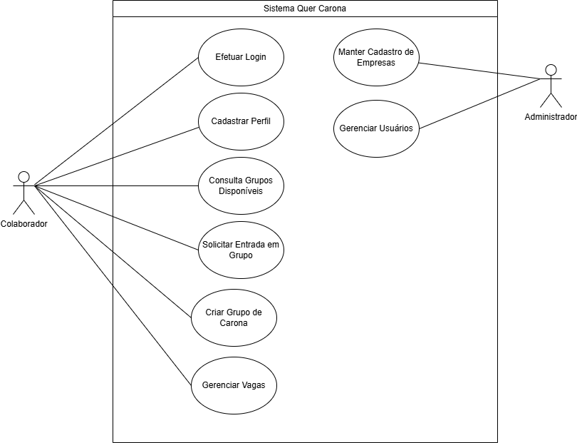
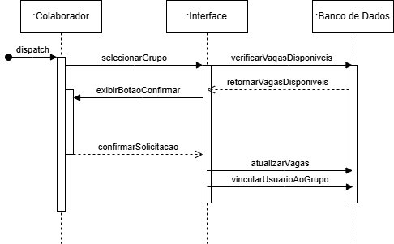
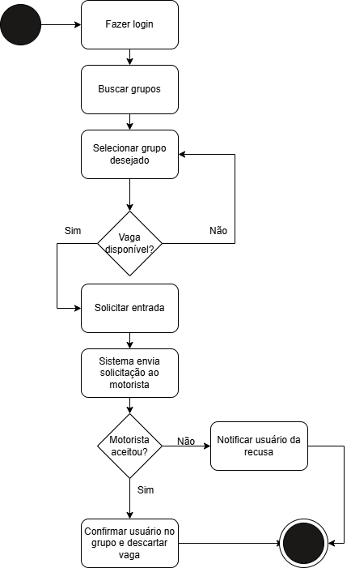

# Quer Carona - Nereu Ramos (Jaraguá do Sul)

## 1. Introdução do Problema
Moradores do bairro Nereu Ramos enfrentam dificuldades de mobilidade devido à distância do centro e à falta de integração entre vizinhos que trabalham nas mesmas regiões. Especialmente para novos moradores, é difícil identificar quem trabalha nas proximidades para organizar caronas.

## 2. Justificativa
Jaraguá do Sul recebe muitos novos habitantes. O projeto visa reduzir o número de veículos, economizar combustível e promover a integração social entre funcionários de empresas vizinhas (3 Rodas, Marisol, WEG, Trapp, Menegotti).

## 3. Objetivos
- **Geral:** Facilitar a formação de grupos fixos de carona para trabalhadores de Nereu Ramos.
- **Específicos:** - Cadastrar colaboradores por empresa.
  - Formar grupos de carona fixos.
  - Integrar funcionários de diferentes empresas próximas.

## 4. Descrição do MVP
Aplicação web para cadastro de usuários e adesão a grupos de carona pré-definidos por destino (Empresas parceiras).

## 5. Modelagem de Dados (Lógico)
Aqui está a estrutura do banco de dados do sistema, focada na integração entre usuários, empresas e grupos de carona.

## 6. Diagrama de Classes
Representação das classes do sistema, seus atributos, métodos e associações.

## 7. Diagrama de Caso de Uso Geral
Mapeamento das funcionalidades do sistema e interação entre os atores (Colaborador e Administrador).

## 8. Diagrama de Sequência
Fluxo de mensagens para o processo de solicitação de entrada em um grupo de carona.

## 9. Diagrama de Atividades
Fluxo lógico de decisão para a adesão de um novo membro a um grupo de carona fixo.

---
## Planejamento de Futura Expansão
Para futuras implementações, o sistema poderá ser expandido para outros bairros e cidades. Estão previstas integrações com APIs de mapas (Google Maps/Waze) para cálculo de rotas em tempo real e automação da divisão de custos de combustível.
